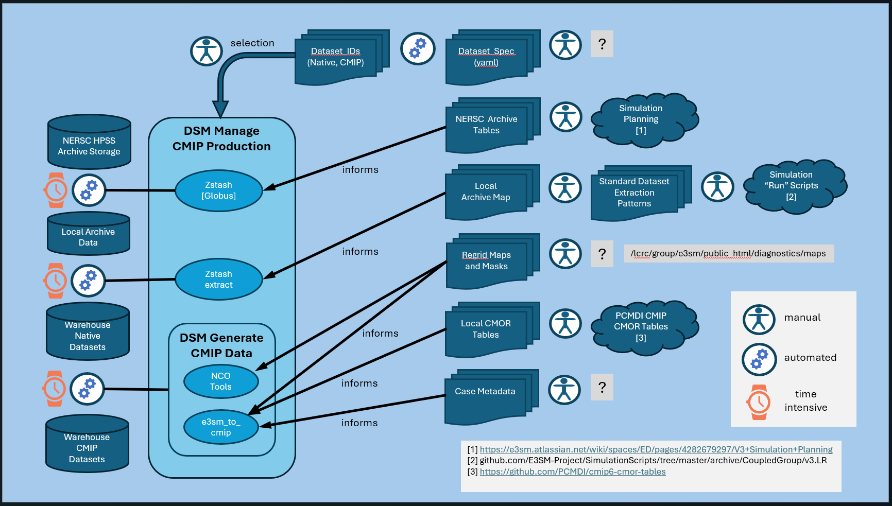
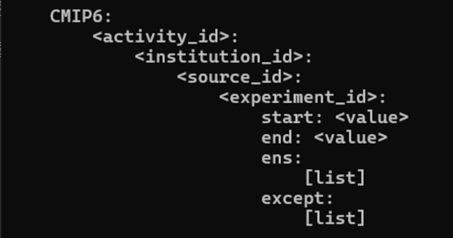
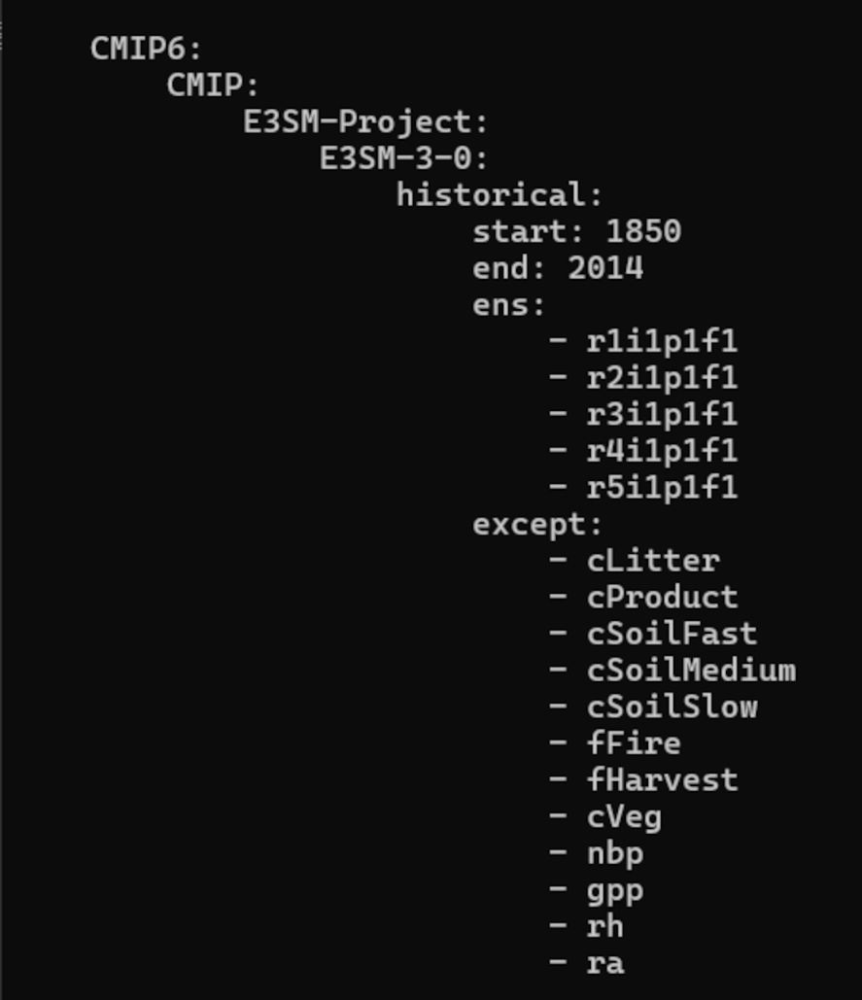
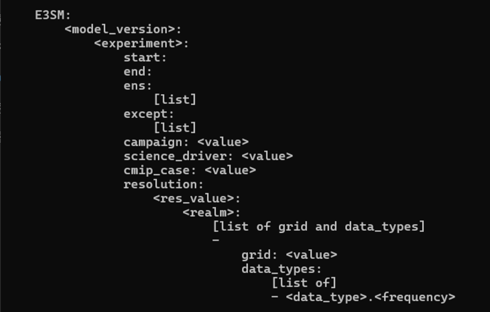
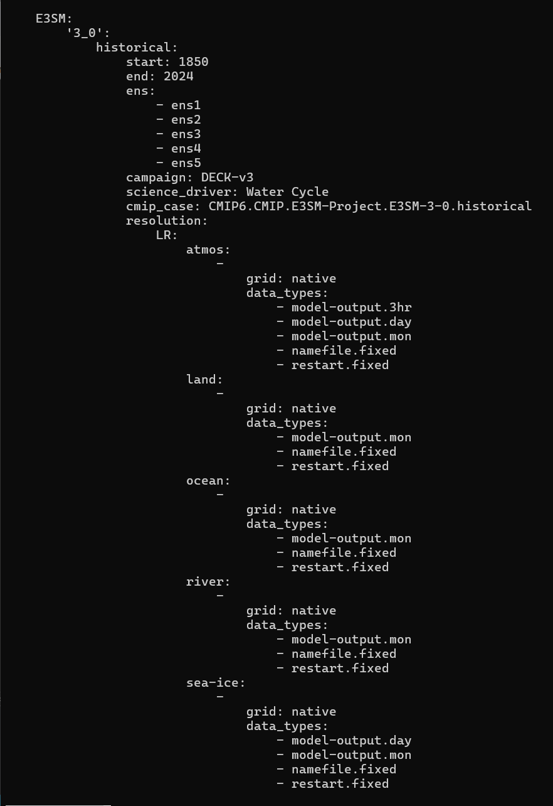
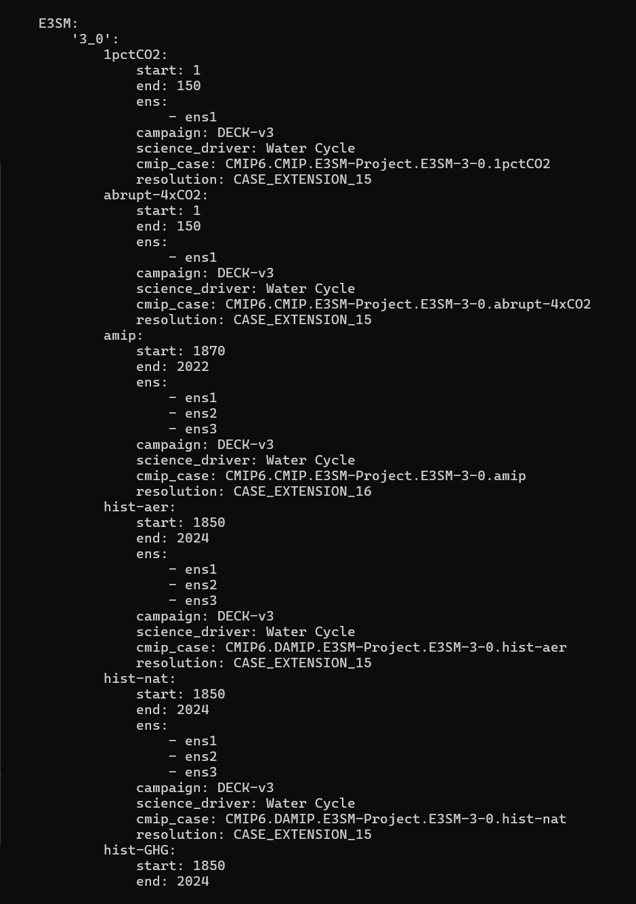
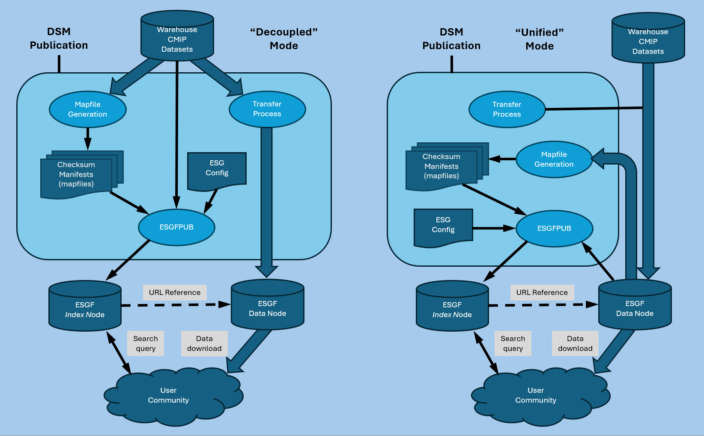

# E3SM CMIP Production Guide
# A.Bartoletti, April 2026

# PREFACE

The job of managing E3SM publications is varied, requiring data
management, coding, and documentation and interpersonal skills.

Familiarity with Earth System simulations and simulation data will be
important for the operational domain knowledge. For the present, it is
enough to know that simulation teams run model-versions of simulation
codes on various supercomputers, producing output stored in
\"archives\". The archives must be accessed, and selected subsets of
data, referred to as \"datasets\", must be extracted, processed, and
published.\
\
Significantly, the raw simulation output "time-series" consists of all
E3SM variables packaged together, most often in "monthly" output files,
and representing either a "cubed earth" grid or hexagonal regionally
refined mesh (RRM) native gridding. In contrast, data published to the
ESGF (Earth Systems Grid Foundation) must conform to CMIP
specifications, with the effective time-series of each CMIP variable
published as an individual dataset. Moreover, many CMIP variables are
not output by E3SM simulations directly but are defined in terms of
formulaic combinations of raw simulation variables. This transformation
to CMIP specification is handled by an application "e3sm_to_cmip", and a
large part of the work of CMIP data generation involves managing the
varied configurations of regridding, masking, and other parameters required
for processing different classes of native simulation data.

But independent of domain, several activities will be required,
routinely or infrequently.

# Conda Environments and Github Repositories

## Conda Environments

Familiarity with Conda environments - creating, activating, and deleting
them - will be critical to ease both testing and production operations.
Each environment makes a different combination of utilities,
applications and their versions available. A command like \"zstash\" may
invoke the latest release version in a production environment, or invoke
a recently-modified, pip-installed test version in a test environment.

When you log in to an E3SM development or production system, you are
placed into a \"base\" environment (usually indicated at the start of
your command-prompt). You should avoid modifying or installing packages
in the base environment, as this is the starting point for environments
you create. By default, environments you create will inherit utilities
from the base environment.

You can create a (datasm) production environment as follows:

- cd \<your_git_repo_directory\>/datasm

- conda env create -n \<new_env_name\> -f conda-env/prod.yml \[This can
  take several minutes\]

- Activate the new environment by issuing "conda activate
  \<new_env_name\>" \[your prompt should change to show the new
  environment\]

- pip install . \[This will install the datasm suite of utility tools
  and process scripts\]

The environment configuration file \"prod.yml\" lists specific versions
or version-ranges for certain utilities needed to support datasm
operations. These will be \"release\" versions automatically pulled down
and installed via conda-forge.

If you switch to another environment, it is recommended that you first
deactivate the current environment:

- conda deactivate \[should return you to the base environment\]

Note: The conda command:

- conda env list

will list all of the conda environments you have created, with an
asterisk (\*) beside the one currently active.

To create a datasm test environment, you follow the same procedure
above, but select an environment name like \"dsm_test\_\<something\>\"
to remind you it is a test environment, \"conda activate\" that
environment, and then, in your \<git_repo_directory\>, you \"cd\" into
any git-cloned application package or project directory containing the
codes you need for testing, and issue:

- pip install .

to have that application and version available to test with in that
environment. You can test changes to the codes in the datasm or other
git-cloned project directories by re-issuing \"pip install .\" in those
respective directories.

## "Screen" Session Isolation

For operational runs that can extend over many hours (or days, or weeks)
you will want to protect those sessions from console terminal logouts or
shutdowns by using "screen" before launching a long-running operation:

- screen -S \<screen_name\>

This will appear as a new terminal session (and may return you to your
"base" conda environment, so you will want to reestablish your desired
operational environment with "conda activate \<env\>"). At any time
thereafter, you can "detach" the screen session with "Ctrl-A Ctrl-D",
which will return you to your pre-screen terminal session. Logging out
of that terminal will not affect the detached "screen" session.

At any future time, if you are logged into the same host, you can issue:

- screen -ls

to obtain the name of any running detached screen, and then issue

- screen -r \<screen_name\>

to resume manual activities within that screen session. To actually kill
the screen session, it must be attached when you issue "exit".
Alternately, you can locate and kill the screen process with "ps gx" and
"kill -9 \<pid\>".

## Github Repositories

A number of github repositories need to be maintained or monitored, as
important operations depend upon them. Those preceded by \[Y\] are your
responsibility to maintain or update. Those with \[\~\] you may be
tasked with assisting, and those with \[-\] just need to be monitored
and re-installed when changes are made by their maintainers.

You should establish a personal github repository directory (e.g.,
\~/gitrepo), In that directory:

- \[Y\] git clone https://github.com/E3SM-Project/datasm.git

- \[\~\] git clone https://github.com/E3SM-Project/CMIP6-Metadata

- \[\~\] git clone https://github.com/E3SM-Project/e3sm_data_docs

- \[\~\] git clone https://github.com/E3SM-Project/e3sm_to_cmip

- \[\~\] git clone https://github.com/E3SM-Project/zstash.git

- \[-\] git clone https://github.com/ESGF/esg-publisher.git

- \[-\] git clone https://github.com/PCMDI/cmip6-cmor-tables

Of these, the first (datasm) is your primary responsibility to maintain
as the CMIP data generation and publication lead.

## ABOUT DATASM:

Being primarily responsible for E3SM/CMIP dataset publication, you are
the primary developer for the \"datasm\" (Data State Machine) project.
Although there is an associated \"datasm\" application, it has fallen
out of use, as many of its subordinate functions have been changed,
superseded, or obviated entirely due to changing workflow expectations.
Originally designed to take archived native data into the \"warehouse\",
\"by dataset\", validate its integrity, and either prepare it for native
publication or as input to CMIP format generations (and then, CMIP
publication) in a fully data-state-driven fashion, this turned out to be
overly ambitious (and overly optimistic). The frequency of \"glitches\"
along the path were sufficiently numerous to demand the ability to
intervene at each major step. This has led to several sophisticated
\"sub-applications\", that can be invoked to automate most major
processing. The original state-file updates are still employed to track
individual dataset status and can be consulted to conduct go/no-go
decisions for processing activities.

Presently, you MUST \"pip install\" the datasm materials into your
production and development/testing environments, as this makes the major
datasm sub-applications, configuration materials, and a score of
important E3SM-specific utilities and resources available to facilitate
all aspects of processing.

The operational details in exercising the DSM tools for general data
management, CMIP dataset generation, or ESGF publication are provided in
the **DSM Operations** section.

# E3SM Domain Knowledge

In the Preface, we briefly described the overall objectives of E3SM
(wherein E3SM teams produce and run Earth System simulations) and the
role of E3SM data publication in refactoring and publishing the
resultant datasets for worldwide consumption.

Herein, we expand upon this description, to introduce nomenclature that
will be used throughout this documentation, and provide a richer
understanding of the entire process.

## The Simulations

Earth System scientists develop very large and complex models of earth
system evolution, requiring many months and even years to code and then
to run -- even on the world's largest supercomputers. What is learned by
running these simulations leads to design improvements that must be
coordinated across teams in order to advance new versions of the models
and conduct a new simulation campaign or what one might think of as a
"wave". As each new wave arrives, the DSM Operational Environment will
need to be updated to accommodate new names and new configuration
details (described below in the section on process automation support).

### Case IDs and Experiments

A major campaign or "wave" will involve multiple "case" runs, each
distinguished by the nature of the initial parameters, (resolutions,
forcings, simulated years, and more). A typical "case_id" will have the
form

```
    <ModelVersion>.<Resolution>.<experiment[_ensemble]>
```

For example:

```
    v3.LR.piControl
    v3.LR.historical_0051
    v3.LR.historical_0201

    etc
```

The modeling operates by dividing the Earth into \~100,000 "cells"
(precise number depends upon the applied resolution), and for each cell,
100+ variables are updated through formulas reflecting the interactions
of the physical quantities they represent (temperature, humidity,
salinity, etc), both within and across cells with a frequency specified
by a given time-resolution (hourly, daily, etc).

### The Model Output

Each case/experiment (typically) coordinates modeling over atmosphere,
land, river, ocean and sea-ice "realms". The "native" model output from
these simulations consists of files that house the history of variable
values for each realm and frequency. Such a collection of output files
will be referred to as a "native dataset". One such dataset might be the
6000 files representing the monthly output for 500 years of piControl
"atmos" variables. This set (for v3.LR) is uniquely specified by the
native dataset_id:

`    E3SM.3_0.piControl.LR.atmos.native.model-output.mon.ens1`

The files of this dataset look like this (month by month):

```
    Size      Date       Filename

    162501128 Mar 6 2024 v3.LR.piControl.eam.h0.0001-01.nc
    162501128 Mar 6 2024 v3.LR.piControl.eam.h0.0001-02.nc
    162501128 Mar 6 2024 v3.LR.piControl.eam.h0.0001-03.nc
    . . .
```

Here, we see the case_id ("v3.LR.piControl") followed by "eam"
indicating the atmosphere model, and "h0" indicating monthly output, and
finally the year (0001) and month for each file. These output files are
"NetCDF" (Network Common Data Form) datafiles, indicated by the ".nc"
file extension. NetCDF is a set of software libraries and
machine-independent data formats that support the creation, access, and
sharing of array-oriented scientific data.

## NERSC Long-Term Storage

The simulation teams use an E3SM tool called "zstash" to create archives
of entire simulation case/experiments. A zstash archive consists of a
single directory of large tar files ("000000.tar", "000001.tar", ... )
and an "index.db" database file that can be queried to identify which
tar files contain dataset files matching a given search pattern. The
zstash tool exploits this feature itself when used to extract selected
native datasets from and archive to the local warehouse directories for
CMIP processing.

Simulation archives are transferred to the NERSC (National Energy
Research Supercomputer Center) HPSS (High Performance tape Storage
System) for long-term storage. The zstash tool (invoking the Globus data
transfer service), or Globus directly, can be employed to retrieve
selected simulation archives. The DSM "NERSC_Archive_Map" holds the
remote NERSC paths to configure the retrieval of selects archives, and
the local "Archive_Map" holds the local archive paths and dataset file
patterns to supply to zstash in extracting the corresponding files to
the E3SM "warehouse", aka \[STAGING_DATA\].

# The DSM Operational Environment

Throughout this documentation, the abbreviation \"DSM\" indicates
procedures, software or facilities provided by, or established for
datasm-supported publication activities.

A major factor in the successful automation of publication-related
operations is the establishment of stable file system locations for key
resources and tools.

## The DataSM Root Paths System

The DataSM System involves scores of ancillary bash and python scripts, as well
as the major application packages (datasm, e3sm_to_cmip, etc).  These ancillary
scripts often rely upon one another.  To avoid having hundreds of hard-coded
paths to subordinate scripts and configuration files, the DataSM Root Paths
System allows these scripts to be moved, per site installation, and still be
located automatically.  Two files, and one (per user) export are required.

A hidden file, ".dsm_root_paths" contains lines of the form

`    <RootTag>:<RootPath>`

and together with a hidden script ".dsm_get_root_path.sh" must be placed in a
system directory readable and executable by all DSM system users.  The script
will need to be edited to hard-code the location of the dsm_root_paths file,
and each user will need to add the line

`    export DSM_GETPATH=/<path-to-the-script>/.dsm_get_root_path.sh`

Once this is done, all of the DataSM system scripts and paths will operate
for this user.

NOTE:  In particular, the ".dsm_root_paths" file is used by the DatsSM
relocation "Manifest_Generator" to convert the user-defined Manifest_Spec
into the full manifest that will be used to collect and form the relocation
tar file.

As example, on Chrysalis, these Root Paths are given as
```
    ARCHIVE_STORAGE:/lcrc/group/e3sm2/DSM/Archive/Data
    ARCHIVE_MANAGEMENT:/lcrc/group/e3sm2/DSM/Archive/Management
    DSM_STAGING:/lcrc/group/e3sm2/DSM/Staging
    STAGING_DATA:/lcrc/group/e3sm2/DSM/Staging/Data
    STAGING_RESOURCE:/lcrc/group/e3sm2/DSM/Staging/Resource
    STAGING_STATUS:/lcrc/group/e3sm2/DSM/Staging/Status
    STAGING_TOOLS:/lcrc/group/e3sm2/DSM/Staging/Tools
    PUBLICATION_DATA:/lcrc/group/e3sm2/DSM/Publication/css03_data
    USER_ROOT:/lcrc/group/e3sm2
```
and are defined in the file:

`    /lcrc/group/e3sm2/DSM/Staging/Relocation/.dsm_root_paths`

You need to place the following command in your \".bashrc\" file:

```
    export DSM_GETPATH=/lcrc/group/e3sm2/DSM/Staging/Relocation/.dsm_get_root_path.sh
```

(Don't forget to "source" your .bashrc, and reactivate your conda env if needed.)

Thereafter, the command:

`    $DSM_GETPATH ALL`

will produce the above listing of dsm root-paths, and a command such as:

`    $DSM_GETPATH STAGING_TOOLS`

will return just the value `"/lcrc/group/e3sm2/DSM/Staging/Tools"`

Commands such as these are used extensively in DSM applications and
tools. Here are some bash and python examples.

USAGE in BASH

`    warehouse_root=$($DSM_GETPATH STAGING_DATA)`

USAGE in PYTHON
```
    import datasm.util

    dsm_paths = get_dsm_paths()
    warehouse_root = dsm_paths["STAGING_DATA"]
```
etc.

IMPORTANTLY, if for some reason you need to move the location of
`[STAGING_DATA]` or `[ARCHIVE_STORAGE]` or any other DSM resource to
another location, you simply need to edit the file:

`    [DSM_STAGING]/Relocation/.dsm_root_paths`

and all applications and tools will continue to work. (If you relocate
the path to `[DSM_STAGING]/Relocation/`, you will also need to edit user
`".bashrc"` files for the definition of `"DSM_GETPATH`, and the
`".dsm_get_root_Paths.sh"` script itself).

Throughout this document, the terms `[ARCHIVE_STORAGE]`,
`[ARCHIVE_MANAGEMENT]`, `[STAGING_RESOURCE]`, `[STAGING_TOOLS]`, etc,
will be used as a shorthand for the corresponding full paths given by
`"$DSM_GETPATH ALL"`.


# Process Automation Support - Maintaining the DSM Infrastructure

Key to automating the E3SM Data Processing is a uniform and reliable set
of resources necessary to drive and auto-configure subordinate
functions. Upgrading and maintaining these resources is a large (and
significantly, manual) part of this job.

Among the core resources are:

- **The E3SM Dataset Spec**

  - Location: \[STAGING_RESOURCE\]/dataset_spec.yaml

  - Purpose: Defines native and CMIP dataset_ID component trees

- **The E3SM Archive Map**

  - Location: \[ARCHIVE_MANAGEMENT\]/Archive_Map

  - Purpose: Locations and native dataset extraction patterns for
    archives

- **The NERSC Archive Locator**

  - Location: \[ARCHIVE_MANAGEMENT\]/NERSC_Archive_Locator

  - Purpose: Locations supporting automated Globus archive transfers

- **The Derivatives Configuration File**

  - Location: \[STAGING_RESOURCE\]/derivatives.conf

  - Purpose: Lists model and realm-specific regridding/masking files

- **The CMIP6 Metadata Files**

  - Location: \[STAGING_RESOURCE\]/CMIP6-Metadata/\<ModelVersion\>/

  - Purpose: Metadata to be embedded in CMIP-generated dataset files

These resources, and how they support the data management, CMIP
generation, and publication processing are detailed in the following
figures and text.

{width="6.5in" height="3.69in"}
`    [CAPTION: E3SM CMIP Production Dependencies]`

The maintenance procedures for each of the process configuration
dependencies depicted in Figure 1 above are detailed in the sections
below:


## THE E3SM DATASET_SPEC

This file, `[your_git_repo]/datasm/datasm/resources/dataset_spec.yaml`,
must be deployed to `[STAGING_RESOURCE]/dataset_spec.yaml` upon updates
for operations.

This (enormous) yaml file is essentially the `"dataset_id_tree"`. It
details, for each major E3SM model-version and campaign, which
experiments and ensembles are produced, their output year-ranges, and
which native datasets (Resolutions, Realms and Frequencies) will be
processed. By "walking" the contained E3SM and CMIP program trees, the
DSM utilities `list_e3sm_dsids.py` and `list_cmip6_dsids.py` can produce
the entire list of both native and CMIP dataset_ids of interest in E3SM
processing, both past and present. The utility of operating over
selected subsets of these dataset_ids will be explained in the section
"The Magical Dataset ID".

**IMPORTANT**

There is an "N to 1" relationship between CMIP datasets (and dataset_ids)
and the native simulation output datasets (and dataset_ids).  In essense,
any given CMIP dataset is a "derived child" of a parent native dataset.
A utility function exists that will provide you the native dataset_id
that serves as the parent data for a given CMIP6 dataset_id.

The E3SM Dataset Spec (`[STAGING_RESOURCE]/dataset_spec.yaml`) contains
3 trees:

- tables (branches listing CMIP variables by realm and frequency)

- time-series (branches listing native variables by atmos or land realm)

- project (branches for CMIP6 and E3SM, defining their variations)

The `"time-series"` tree was only employed to generate E3SM datasets
published outside of the CMIP regime, and has largely fallen into
disuse.

The `"project"` sub-trees CMIP6 and E3SM are so different in structure
that they must be described separately below.

**The project CMIP6 tree:**

The general structure is given in the following figure:

{width="4.09in" height="2.15in"}
`    [CAPTION: Dataset Spec CMIP Tree Definition]`

**Example of project CMIP6 tree member:**

{width="4.026in" height="4.67in"}
`    [CAPTION: Dataset Spec CMIP Tree Example]`

**The project E3SM tree:**

The general structure is given in the following figure:

{width="5.36in" height="3.42in"}
`    [CAPTION: Dataset Spec E3SM Tree Definition]`

**Example of Project E3SM tree member (modelVersion 3.0, experiment=historical):**

{width="5.13in" height="7.46in"}
`    [CAPTION: Dataset Spec E3SM Tree Example]`

Note that the \"cmip_case\" given here
(CMIP6.CMIP.E3SM-Project.E3SM-3-0.historical) will correspond to a
branch of the \"project: CMIP6\" tree whose CMIP datasets can be derived
from these native datasets.

**Editing support: The dsspec contract and expand utilities**.

In its extended form, the dataset_spec.yaml file is unwieldy to edit or
assess (scrolling through its 5200+ lines, it is very easy to lose track
of your location in the tree). There are compress-expand utilities
("dsspec_contract.py" and "dsspec_expand.py") that converts it to and
from a form more easily edited (many dataset-branches are common to
multiple cases, and are refactored to a separate tree).

Consider the above example project branch \"E3SM: 3_0\": Only a single
experiment (historical) is shown. In the actual E3SM dataset_spec.yaml
file, there are over 80 experiment branches, spread over model-versions
\'1_0\', \'1_1\', \'1_1_ECA\', \'1_2_1\', \'1_3\', \'2_0\',
\'2_0_NARRM\', \'2_1\', \'3_0\', etc. Given the length of their
\"resolution\" sections, a great deal of scrolling up and down can be
required to locate and edit, copy or create a new experiment entry under
a new branch.

Furthermore, despite there being over 80 such branches, there are
actually (at present) only 17 uniquely different \"resolution\"
specifications, with many used repeatedly across different models and
experiments.

A pair of DSM utility tools, "dsspec_contract.py" and
"dsspec_expand.py" can be employed to refactor the "project: E3SM"
section of the dataset_spec, replacing each resolution section with an
extension_id "CASE_EXTENSION_nn", and the original resolution
specification is moved to a new tree named "CASE_EXTENSIONS".

Here is a sample of the same `"E3SM: '3_0':"` section after contraction:

{width="4.91in"
height="6.98in"}
`    [CAPTION: Dataset Spec E3SM Tree Contracted Example]`


## The E3SM Archive Map

This file, deployed to \[ARCHIVE_MANAGEMENT\]/Archive_Map, provides the
path to each locally-held simulation archive (\[ARCHIVE_DATA\]/\*) and
supplies the (zstash) extraction pattern sufficient to extract the
native data files from a selected native dataset, keyed by providing a
native dataset_id.

Each line of the Archive_Map has the format:

`    <Campaign>,<native_dataset_id>,<local path to archive>,<extraction pattern>`

This file is used automatically by the zstash call embedded in the
dsm_manage_CMIP workflow, whereupon the extracted dataset files are
placed into the "warehouse" (`[STAGING_DATA]`) for subsequent
processing. This will be detailed later in the **Operations** section of
this document.

When a new wave of simulation data processing arrives, one must (having
updated the "E3SM dataset_spec' described previously), issue

`    [STAGING_TOOLS]/list_e3sm_dsids.py | grep E3SM.<version>`

to list all of the new native dataset_ids, and ensure each is the key to
an appropriate archive path and dataset extraction pattern in the
Archive_Map.

It is unfortunate that a given dataset from a single experiment and
ensemble may be spread across not only multiple archives, but even under
multiple tar-paths within an archive, due to runs that were \"broken\"
by year-range, and even by the machine upon which partial runs were
conducted. One must therefore be prepared to process multiple lines and
paths, even for a single dataset.

The inconsistencies in archive names and tar-paths, even for otherwise
identically-names files across the span of campaigns and authors
necessitate the files included herein for automation.

NOTE: These patterns alone may be insufficient to isolate the desired
dataset files from a given archive, because different archives place the
same files under multiple and varied tar-paths. That is, a given dataset
filename may appear multiple times in an archive under the tar paths
```
    run/filename
    rest/filename
    archive/atm/hist/filename
```
and across archives from different authors or campaigns, these paths may
appear as
```
    archive/atm/hist/filename (in one archive)
    atm/hist/filename (in a different archive)
```
One must carefully craft the match-pattern to be employed, to ensure
that only the intended filed are matched by the entry.

## Standard Dataset Extraction Patterns

The file \[ARCHIVE_MANAGEMENT\]/Standard_Dataset_Extraction_Patterns
gives the wild-card patterns that isolate dataset filenames according to
Dataset Type. A few lines of this file are included here to illustrate:

```
    atmos.native.3hr,model-output,*cam.h3*.nc,BGC-v1,
    atmos.native.3hr,model-output,*cam.h4*.nc,CRYO-v1 DECK-v1 HR-v1,
    atmos.native.3hr,model-output,*eam.h3*.nc,BGC-v2 DECK-v3,
    atmos.native.3hr,model-output,*eam.h4*.nc,CRYO-v2 DECK-v2 DECK-v2_1 HR-v2,
    atmos.native.3hr_snap,model-output,*cam.h2*.nc,BGC-v1,
    atmos.native.3hr_snap,model-output,*eam.h2*.nc,BGC-v2,
    atmos.native.6hr,model-output,*cam.h3*.nc,CRYO-v1 DECK-v1 HR-v1,
    atmos.native.6hr,model-output,*eam.h2*.nc,DECK-v3,
    atmos.native.6hr,model-output,*eam.h3*.nc,CRYO-v2 DECK-v2 DECK-v2_1 HR-v2,
    atmos.native.6hr_snap,model-output,*cam.h2*.nc,CRYO-v1 DECK-v1 HR-v1,
    atmos.native.6hr_snap,model-output,*eam.h2*.nc,CRYO-v2 DECK-v2 DECK-v2_1 HR-v2,
    atmos.native.day_cosp,model-output,*cam.h5*.nc,BGC-v1 CRYO-v1 DECK-v1 HR-v1,
    atmos.native.day_cosp,model-output,*eam.h5*.nc,BGC-v2 CRYO-v2 DECK-v2 DECK-v2_1 HR-v2,
    atmos.native.day,model-output,*cam.h1*.nc,BGC-v1 CRYO-v1 DECK-v1 HR-v1,
    atmos.native.day,model-output,*eam.h1*.nc,BGC-v2 CRYO-v2 DECK-v2 DECK-v2_1 DECK-v3 HR-v2,
    atmos.native.fixed,namefile,run/atm_in,BGC-v1 BGC-v2 CRYO-v1 CRYO-v2 DECK-v1 DECK-v2 DECK-v2_1 DECK-v3 HR-v1 HR-v2,,
    atmos.native.mon,model-output,*cam.h0*.nc,BGC-v1 CRYO-v1 DECK-v1 HR-v1,
    atmos.native.mon,model-output,*eam.h0*.nc,BGC-v2 CRYO-v2 DECK-v2 DECK-v2_1 DECK-v3 HR-v2,
    land.native.day,model-output,*clm2.h1*.nc,BGC-v1 CRYO-v1 DECK-v1 HR-v1,
    land.native.day,model-output,*elm.h1*.nc,BGC-v2 CRYO-v2 DECK-v2 DECK-v2_1 DECK-v3 HR-v2,
    land.native.fixed,namefile,run/lnd_in,DECK-v1 DECK-v2 DECK-v2_1 DECK-v3,
    land.native.mon,model-output,*clm2.h0*.nc,BGC-v1 CRYO-v1 DECK-v1 HR-v1,
    land.native.mon,model-output,*elm.h0*.nc,BGC-v2 CRYO-v2 DECK-v2 DECK-v2_1 DECK-v3 HR-v2,
    ocean.native.5day_snap,model-output,*mpaso.hist.am.highFrequencyOutput.*.nc,BGC-v1 BGC-v2 CRYO-v1 CRYO-v2 DECK-v1 DECK-v2 DECK-v2_1 HR-v1 HR-v2,
    ocean.native.fixed,namefile,run/mpas-o_in,BGC-v1 BGC-v2 CRYO-v1 CRYO-v2 DECK-v1 DECK-v2 DECK-v2_1 HR-v1 HR-v2,
    ocean.native.fixed,namefile,run/mpaso_in,BGC-v1 BGC-v2 CRYO-v1 CRYO-v2 DECK-v1 DECK-v2 DECK-v2_1 DECK-v3 HR-v1 HR-v2,
    ocean.native.fixed,restart,*mpaso.rst*.nc,BGC-v1 BGC-v2 CRYO-v1 CRYO-v2 DECK-v1 DECK-v2 DECK-v2_1 DECK-v3 HR-v1 HR-v2,
    ocean.native.fixed,streams,run/streams.ocean,BGC-v1 BGC-v2 CRYO-v1 CRYO-v2 DECK-v1 DECK-v2 DECK-v2_1 HR-v1 HR-v2,
    ocean.native.mon,model-output,*mpaso.hist.am.timeSeriesStatsMonthly.*.nc,BGC-v1 BGC-v2 CRYO-v1 CRYO-v2 DECK-v1 DECK-v2 DECK-v2_1 DECK-v3 HR-v1 HR-v2,
```

Note that there are "h-codes" in many output files (e.g. eam.h0, eam.h1,
elm.h0, etc) that are used to indicate both realm and frequency (atmos
mon, atmos day, land mon), but for frequencies above "day" (6hr, 3hr,
6hr_snap, etc) different campaigns and model versions have employed some
codes (h3, h4) to indicate different frequencies. Therefore, the
campaigns that have employed selected codes for selected frequencies are
listed in this file for convenience in maintaining and updating the
extraction patterns used in the aforementioned Archive_Map.

With each new simulation "wave" one must ensure that the correct
"h-codes" are being applied, and summarized in the
Standard_Dataset_Extraction_Patterns file. The procedure (at present) is
as follows:

1.  git clone https://github.com/E3SM-Project/SimulationScripts/

2.  Navigate to "archive/CoupledGroup/\<ModelVersion.Resolution\>
    \[Here, "v3.LR"\]

3.  Ply each "run.\<case_id\>.sh" script to obtain the sequence of
    values for
```
    aveflag_pertape
    nhtfrq
    mfilt
```

and process into corresponding (h0, h1, ... h5) CMIP6 "frequency values"

EXAMPLE:

```
    avgflag_pertape = 'A','A','A','A','I','I'
    nhtfrq = 0,-24,-6,-3,-1,0
    mfilt = 1,30,120,240,720,1
```

Assuming these represent h0, h1, h2, h3, h4, h5

and A = "Average" and I = "Instantaneous" ("\_snap"),

and nhtfrq gives \"hours per record\" (mon, day, 6hr, 3hr, 1hr, mon)

and mfilt gives "records per file"

I will deduce:

```
    h0 = mon
    h1 = day
    h2 = 6hr
    h3 = 3hr
    h4 = 1hr_snap
    h5 = mon_cosp ?
```

These latter terms (mon, day, 6hr, 3hr, 1hr_snap, mon_cosp and other
variants) only appear in the native dataset_ids (borne of the E3SM
dataset_spec.yaml).

While they are not part of the CMIP6 dataset_ids, each CMIP6 dataset_id
infers a corresponding native "parent" dataset_id, indicating which
specific archive native dataset holds the required native variables.

For instance, when one issues:
```
    parent CMIP6.CMIP.E3SM-Project.E3SM-3-0.1pctCO2.r1i1p1f1.Amon.huss.gr

    (parent=[STAGING_TOOLS]/parent_native_dsid.sh)
```
one obtains:

`    E3SM.3_0.1pctCO2.LR.atmos.native.model-output.mon.ens1`

That "parent native" dataset_id is a key into the Archive_Map table,
that allows one to automate zstash extraction. Example:

`    grep E3SM.3_0.1pctCO2.LR.atmos.native.model-output.mon.ens1 /lcrc/group/e3sm2/DSM/Archive/Management/Archive_Map`

gives
```
    DECK-v3,E3SM.3_0.1pctCO2.LR.atmos.native.model-output.mon.ens1,/lcrc/group/e3sm2/DSM/Archive/Data/3_0/DECK-v3/v3.LR.1pctCO2_0101_bcdt15m,archive/atm/hist/v3.LR.1pctCO2_0101_bcdt15m.eam.h0.*.nc
```

(That's "Campaign", "Native_Dataset_ID" (key), "Local Archive Path",
"Archive Tar-Path/File-Match Pattern"). This allows the construction of
the zstash command-line needed to extract the "eam.h0" (atmos monthly)
datafiles from the v3 LR 1pctCO2 ensemble 1 experiment, necessary for
generating the CMIP dataset for "Amon.huss".

These configs and functions are KEY to the automation of CMIP6
production, driven by lists of desired CMIP6 dataset_ids.

## The NERSC Archive Locator File

Earlier, we noted that the E3SM Archive_Map lines have 4 fields, the third field being

`    <local path to archive>`  (zstash case archive location, if present)

Whether or not that archive is present locally, the "basename" (tail directory) of that
path represents the archive CaseID, and serves as a key into the file:

`    [ARCHIVE_MANAGEMENT]/NERSC_Archive_Locator`

This file gives the "NERSC_HPSS" (NERSC High Performance Tape Storage System) path to
the long term archive storage for the case archive in question, serving to automate
the Globus (or zstash/globus) transfer of such archive to local space for processing.

The NERSC Archive Locator lines have the form:

`    MajorCategory,CaseID,DataSize,CMIP_link,NATV_link,Archive_Path`

For example:
```
    LR:DECK,v2.LR.piControl,39,CMIP,Native,/home/projects/e3sm/www/WaterCycle/E3SMv2/LR/v2.LR.piControl
    LR:DECK,v2.LR.piControl_land,na,na,na,na
    LR:DECK,v2.LR.abrupt-4xCO2_0101,12,CMIP,Native,/home/projects/e3sm/www/WaterCycle/E3SMv2/LR/v2.LR.abrupt-4xCO2_0101
    LR:DECK,v2.LR.abrupt-4xCO2_0301,13,CMIP,Native,/home/projects/e3sm/www/WaterCycle/E3SMv2/LR/v2.LR.abrupt-4xCO2_0301
    LR:DECK,v2.LR.1pctCO2_0101,12,CMIP,Native,/home/projects/e3sm/www/WaterCycle/E3SMv2/LR/v2.LR.1pctCO2_0101
    LR:Historical,v2.LR.historical_0101,13,CMIP,Native,/home/projects/e3sm/www/WaterCycle/E3SMv2/LR/v2.LR.historical_0101
    LR:Historical,v2.LR.historical_0151,13,CMIP,Native,/home/projects/e3sm/www/WaterCycle/E3SMv2/LR/v2.LR.historical_0151
    . . .
```

The "DataSize" (in TB) serves to avoid initiating a transfer when insufficient local space
would exist to receive the data.

NOTE:  The field "NATV_LINK" is a placeholder employed only in the HTML version of this table.

Under intended circumstance, when the CMIP6 generation process is active, each desired CMIP6
dataset_id is translated to its parent native dataset_id, whose data in then sought in the
E3SM warehouse (`[STAGING_DATA]`).  If not present, the parent dataset_id is sought in the
Archive_Map to obtain its local path and pattern for zstash extraction.  If that archive is
not locally available, the basename of the archive path is used as a key into the NERSC
Archive Locator file, ideally to automate the globus transfer and eventual dataset extraction.

**IMPORTANT**

At present, this sequence of "fetch archive", "extract native dataset", "conduct CMIP generation"
occurs sequentially - meaning that during the days (and sometimes weeks) it takes to transfer
and extract the necessary native data, all other processing is suspended.  This should be
remedied by making these three operations asynchronous, with request tickets passed between
them, so that no hang-ups or delays incurred by one aspect of the processing can interfere
with the other functions. Each dependent process can conduct "lookahead" of its request tickets
to determine whether it will be able to service the request directly, or will need to issue
a ticket to another process to establish the required data.


## The Derivatives Configuration File

This configuration file:

`    [STAGING_RESOURCE]/derivatives.conf`

is used by `dsm_generate_CMIP6.py` to select regridding and region mapping/masking files
when calling NCO tools (ncclimo, et al) and e3sm_to_cmip, in the process of generating
CMIP6 datasets.  Each line consist of 5 CSV fields, the first 3 of which identify the
realm, model, and resolution. For each such triple, there are multiple parameter types,
and so the remaining 2 fields are the type and value.  Hence, each line has the form:

`    <realm>,<model_version>,<resolution>,<param_type>,<param_value>`

For example, the full complement of entries for model 3_0 low res (LR) are:
```
    atmos,3_0,LR,CASE_FINDER,\.eam\.h\d\.
    atmos,3_0,LR,FILE_SELECTOR,.eam.h
    atmos,3_0,LR,REGRID,map_ne30pg2_to_cmip6_180x360_traave.20231201.nc
    land,3_0,LR,CASE_FINDER,\.elm\.h\d\.
    land,3_0,LR,FILE_SELECTOR,.elm.h
    land,3_0,LR,REGRID,map_r05_to_cmip6_180x360_traave.20231110.nc
    ocean,3_0,LR,MASK,IcoswISC30E3r5_mocBasinsAndTransects20210623.nc
    ocean,3_0,LR,REGRID,map_IcoswISC30E3r5_to_cmip6_180x360_traave.20240221.nc
    sea-ice,3_0,LR,REGRID,map_IcoswISC30E3r5_to_cmip6_180x360_traave.20240221.nc
```
Note:  For the Argonne deployment, the maps:
`    /lcrc/group/e3sm/public_html/diagnostics/maps` is a resource for regridding maps
and region masking files.


## CMIP_CMOR_TABLES

If you cd to `[STAGING_RESOURCE]/cmor` and then issue

`    git clone https://github.com/PCMDI/cmip6-cmor-tables`

you have effectively deployed the cmor tables for e3sm_to_cmip
operation. However, when you git-clone datasm, there are a number of
resources that must be (presently) deployed manually, and for which you
are responsible for maintaining:

## The CMIP6 Metadata Files

Also referred to as the "User Metadata" files, the information from these files
is embedded into the generated CMIP6 dataset files as part of the e3sm_to_cmip 
"CMORizing" process.  The metadata files are installed in

`    [STAGING_RESOURCE]/CMIP6-Metadata/`

by issuing the command `git clone https://github.com/E3SM-Project/CMIP6-Metadata`.
The maintenance of this repository is one of the duties associated with this job.
Whenever a new "wave" of simulation data arrives, it will consist of several
"experiment-ensembles", identified by a unique "case_id", such as "v3.LR.amip",
"v3.LR.historical_0101", etc. Each such case will require its own metadata file

### Metadata Content and Format

```
MUST EXPAND on format and content of metadata files here, including the 
"branch_time_in_parent" calculations and other parent/child relationships.
```


# THE DSM APPLICATIONS AND TOOLS

When you `"git clone"` datasm to your git repository, in addition to:

1.  Using its \"datasm/conda-env/prod.yml to produce your core conda
    environment

`        conda env create -n <chosen env-name> -f conda-env/prod.yml`

2.  Making datasm/util.py functions available for imports from your
    environment with:

`        pip install .`

You must also deploy the suite of datasm applications and tools to
`[STAGING_TOOLS]`. This deployment can be conducted by issuing:

`    [your git repo]/datasm/datasm/tools/Local_Deployment.sh`

NOTE: If you have made operational changes to tools or resources in
their deployed locations, and neglected to reflect those changes in the
git datasm repository, run:

`    [your git repo]/datasm/datasm/tools/Local_Deployment_Diff.sh`

to examine the difference between the repo files and the operationally
deployed files.


# DSM Operations

Assuming all of the DSM support resources mentioned above are up-to-date
(dataset_spec, archive_map, NERSC_locator, regrid/mask configurations,
and metadata files), one is ready to engage CMIP6 generation or
publication for any available native case data covered by those
resources.

## Managing the Production of CMIP Datasets

Where the required native source datasets are properly located (or
sym-linked to) their warehouse facet-paths:

`    [STAGING_DATA]/E3SM/<facets>/<version>/<datafiles>.nc`

one need only create the list of CMIP dataset_ids one intends to
produce, using

`    list_cmip | <filters> > my_dsid_list`

and then issue

`    ./run_dsm_manager.sh my_dsid_list &`

to have the resulting cmorized CMIP datasets produced and moved to the
warehouse as

`    [STAGING_DATA]/CMIP6/<facets>/<version>/<datafiles>.nc`

in preparation for publication when authorized.

If the required native datasets are not yet in the warehouse, the DSM
production manager will seek the appropriate local zstash archive and
trigger the extraction of datasets to the expected warehouse locations,
or else seek such zstash archives from the NERSC HPSS storage facility,
transferred via zstash/Globus operations.

The script `"./run_dsm_manager.sh"` sets up overflow logging to capture
stderr output if needed, and then calls

`    [STAGING_TOOLS]/dsm_manage_CMIP6_production.py`

### The LOCK Directory

Upon invoking the DSM Manager, a directory named \"LOCK\_\<YYYYMMDD\>\"
will be created in your current directory, and all subsequent operations
will be managed therein. If you attempt to re-invoke the DSM Manager
while this LOCK directory is present (on the same UTC date in the same
current directory), the manager will refuse to launch. This prevents
multiple manager processes from creating conflicting content within the
operational area.

If you must run another manager in parallel to one that is currently
running, use

`    ./run_dsm_manager_altlock.sh my_dsid_list <LOCKDIR_NAME> &`

providing a LOCKDIR_NAME that does not conflict with any existing lock
directory.

### Operational Details:

The directory

`    [USER_ROOT]/DSM/Ops/DSM_Manager/`

should be your base of operations when conducting CMIP dataset
generation.

The DSM Manager (dsm_manage_CMIP6_production.py) invoked via

`    ./run_dsm_manager.sh <dataset_id_listfile> &`

will take the supplied list of desired CMIP datasets (ids), and for each
dataset_id will:
```
A.  Attempt to secure the corresponding native data (either locate it in the warehouse
    or seek to have it retrieved and/or extracted).

B.  Call "[STAGING_TOOLS]/dsm_generate_CMIP.py" to:

    a.  Fully determine the required configuration materials (regridding files and
        masks, metadata file, command-line flags) and the sequence of operations
        (for non-MPAS data, tools such as ncclimo and ncremap for data preparations),
        and finally determine the proper invocation of "e3sm_to_cmip".

    b.  Produce and execute a fully-configured custom python script:

            <cmip_dataset_id>.py

        that will conduct all necessary operations, to include partitioning the
        native and intermediate input files by "per-decade" subdirectories and
        submitting the required operations in decade-parallel to slurm/srun.

C.  Upon completion, move the resulting CMIP datafiles to their warehouse location
    and collect the run-script and various output logs (cmor_logs, e2c_logs, and
    the dsm_generate log to a "RUN_RECORDS/<dataset_id>/" directory for forensic
    examination if needed.
```
Having retained the important "run evidence", most content of the LOCK
directory is then wiped, in preparation for processing the next CMIP
dataset_id of the input.

### Layout Details:

During operation, the following directories and files should appear:
```
    <your_current_directory>/

        LOCK_<YYYYMMDD>/

            dsmman_logs/ (log of the dsm_manager, retained across datasets)

            dsmgen_logs/ (log of dsm_generate, specific to each dataset)

            info_yaml/ (output of "e3sm_to_cmip --info", per variable)

            <case_id>/ (retained for all datasets of a given case)

            caselogs/ (log of the custom script, one per dataset)

                metadata/ (one per case/ensemble)

                native_data/ (holds decade-subdirectories, each with symlinks)

                native_out (holds nco/timeseries output for non-MPAS datasets)

                product/ (holds finished facet-path cmip dataset files)

                rgr/ (holds nco/ncremap output from native_out, non-MPAS)

                rgr_vert/ (holds vertical regridded for 3D variable, non-MPAS)

                scripts/ (holds the custom-created python script, per dataset)

        RUN_RECORDS/
```

### Monitoring Progress and Assessing Completion

Consequent to CMIP processing, a "job ticket" will appear in your
current directory for each dataset as it is being processed, and will
remain until you delete them. They are named:

`    dsm_gen-<dataset_id>`

All but the latest should be completed (pass or fail), and a simple
routine

`    ./zquickcheck.sh`

will employ these to provide an assessment of output results. (e.g.):
```
    WH_PATH: [STAGING_DATA]/CMIP6/CMIP/E3SM-Project/E3SM-3-0/historical/r12i1p1f1/Amon/rlutcs/gr: (v20251204: 18 files)
    WH_PATH: [STAGING_DATA]/CMIP6/CMIP/E3SM-Project/E3SM-3-0/historical/r12i1p1f1/Amon/rlut/gr: (v20251204: 18 files)
    WH_PATH: [STAGING_DATA]/CMIP6/CMIP/E3SM-Project/E3SM-3-0/historical/r12i1p1f1/Amon/rsdscs/gr: (v20251204: 18 files)
    WH_PATH: [STAGING_DATA]/CMIP6/CMIP/E3SM-Project/E3SM-3-0/historical/r12i1p1f1/Amon/rsds/gr: (v20251204: 18 files)
    WH_PATH: [STAGING_DATA]/CMIP6/CMIP/E3SM-Project/E3SM-3-0/historical/r12i1p1f1/Amon/rsdt/gr: NO_RESULTS
```
If any line other than the last (currently in progress) report
"NO_RESULTS", it is an indication of failure, and the RUN_REPORTS
for the dataset_id-named directory should be examined for errors
reported in the logfiles.

More generally, we can take any list of dataset_ids (typically those
submitted for CMIP generation, or a subset thereof) and issue:

`    dspilc <dsid_list> | grep WH_PATH`

to obtain the warehouse dataset file counts for selected datasets.

#### Monitor in-Progress

If you wish to monitor the detailed progress of the dataset currently
being generated, you can view the running logfile of the custom script
conducting that processing:

`    LOCK_<YYYYMMDD>/<case_id>/caselogs/<dataset_id>.sublog`

Every 5 minutes, it will summarize the progress of each parallel decade
submitted to slurm/srun, both for the (non-MPAS) nco operations and for
the e3sm_to_cmip processing. Typical per-decade status will be
"pending", "running", "failed" or "completed".

NOTE: The elapsed time (srun CPU time) for each decade is reported, and
the average srun CPU time for all "completed" decade jobs is calculated.
As decades are assumed to use approximately the same amount of CPU
runtime, any decade jobs that exceed 5 times the average for completed
jobs will be treated as "hung" and terminated with "scancel". This
ensures that a hung dataset_id will not interfere with subsequent
dataset submissions.

### Cleanup

Three important manual activities should be addressed upon completion of
a dsm_managed run of dataset_ids:
```
1.  A thorough assessment of successes and failures. Failed datasets
    should be itemized in a list for a subsequent re-run. Often, some
    jobs simply fail randomly due to slurm file-I/O issues, and
    typically succeed on a subsequent run. Others may need data or code
    issues be addressed.

2.  The LOCK_<YYYYMMDD>/dsmman_logs/<logfile> should be moved to
    the current work directory "dsmman_logs" , and eventually the entire
    lock directory "LOCK_<YYYYMMDD>" should be removed.

3.  The RUN_RECORDS directory will have accumulated a subdirectory for
    each dataset_id where processing was attempted, often irrespective
    of success. It is valuable to maintain these (configuration and
    run-log output), both for forensic debugging use and for performance
    statistics. However, they use a great many inodes, and it is best to
    create and store a tarfile archive of these directories (reducing to
    a single inode). Example:

        tar cvf Run_Reports/v3_LR_historical.tar RUN_RECORDS/v3_LR_historical*

        rm -rf RUN_RECORDS/v3_LR_historical*

    One can later select and extract the record for any given dataset_id by

        tar tvf Run_Reports/v3_LR_historical.tar | grep <dataset_id>

        tar xvf <tar_path_for_dataset_id> Run_Reports/v3_LR_historical.tar
```


## Managing the Publication of CMIP Datasets

### Publication Authorization and Late Metadata Updates

Publication of E3SM CMIP6 datasets (to ESGF, the Earth Systems Grid
Federation) cannot proceed until the data authors are ready to have the
data made available. This often coincides with the acceptance of a
scientific paper describing the simulation data, and in particular
demands that the paper references appear in the metadata of every
published datafile.

Once a suitable \<references_string\> has been obtained in consultation
with the appropriate simulation team, it can be edited into the metadata
of all of the dataset files of the prepared CMIP datasets using:

`    [STAGING_TOOLS]/set_datafile_metadata_textvalue_by_dsid_list.sh <dsid_listfile> references <references_string>`

### Maintaining the ESGF Publication Configuration File

Another prerequisite to publication is ensuring that the ESGF
publication configuration file is up-to-date:

`    ~/.esg/esg_<site>.yaml` (currently, 'esg_anl.yaml' is in use. See Appendix)

The details and format of this configuration file tend to change as ESGF
progresses, and it is best to consult a contact in ESGF to ensure that
it will correctly reflect your site's specific environment. See
"Appendix: ESGF Publication Configuration File" for details.

### Publication Operational Details

Mechanically, publication of the finalized CMIP datasets to ESGF is
comprised of three component operations:
```
1.  Placement of dataset datafiles on a suitable ESGF datanode.

2.  Generation of the checksum manifest (map) files for each dataset.

3.  Update of the ESGF Index with publication manifest (map) files.
```
In essence, once the manifest files for each dataset are produced, an
"esgpublish" utility employs that manifest to examine and validate each
dataset file and (via the esg config file) update database tables in an
ESGF index/search node, allowing fine-tuned searches to identify and
provide access to datafiles that have been placed on an ESGF datanode,
wherein they become available to the user community.

Two important publication configurations may be employed, depending upon
site-specifics. These are illustrated below:

{width="6.5in" height="4.03in"}
`    [CAPTION: Alternative E3SM Publication Configurations]`

On the left we represent the "Decoupled" publication configuration.
Here, the datafiles moved to the ESGF Datanode are no longer accessible
for processing by the publication system. Therefore, a copy must remain
in the E3SM warehouse for checksum manifest (mapfile) generation, and to
inform the ESG Publisher process where to find the files for live
inspection. The publisher (ESGFPUB) must be informed of the file's ESGF
Datanode paths through values provided in the "ESG Config" file. The
publisher updates the federated ESGF index tables on the ESGF search
nodes, providing users with refined selection criteria and the URLs
referencing datanode locations for downloads.

On the right, we represent "Unified Mode". Here, files are first moved
to the ESGF datanode, and may then be deleted from the warehouse
immediately -- as all subsequent operations (mapfile generation and ESGF
Publication) can operate upon the files at the datanode itself.

Currently, Argonne employs the Decoupled configuration.

#### Special Note for CMIP Publication Post-2025

Due to the (ESGF) closure of CMIP6 as a "mip_era", we have created a new Project (mip_era):

    CMIP6-E3SM-Ext

However, this designation only needs to appear during certain publication operations.
Internally, our local (E3SM) CMIP6 dataset_ids will still read

    CMIP6.<activity>.<institution_id>.<source_id>.<experiment>.<member>.<table>.<variable).<grid>

so that location lookups, Archive_Map entry lookups, and status-file names will remain intact.

Lists of these dataset_ids will still suffice to represent input-lists for various DSM processing.

Likewise, the warehouse paths will remain

    CMIP6/<activity>/<institution_id>/<source_id>/<experiment>/<member>/<table>/<variable)/<grid>

HOWEVER, Prior to publication, the warehouse source paths must be made to appear (via symlink?) as

    CMIP6-E3SM-Ext/<activity>/<institution_id>/<source_id>/<experiment>/<member>/<table>/<variable)/<grid>

This will facilitate the globus transfer to the Eagle Data Node (ALCF ESGF Data Node) under

    "user_pub_work/CMIP6-E3SM-Ext/" (or possibly "css03_data/CMIP6-E3SM-Ext/")

This will also facilitate the pre-publication mapfile (checksum manifest) generation, as the warehouse
source paths and generated ESGF dataset_ids will reflect the new Project/mip-era component.

NOTE that all dsm tools relevent to these publication activities (globus transfers, mapfile generation,
and esg-publication) must be cognizant of the presence of v3 data, and apply either "CMIP6" or the new
"CMIP6-E3SM-Ext" as appropriate, to update status files, etc.

To date, this have been accomplished by creating a symlink "CMIP6-E3SM-Ext" in the [STAGING_DATA] 
directory, that points to the actual "CMIP6" directory.  Thereafter, whan a publication-related
script processes "CMIP6" dataset IDs, it replaces that dsid with one where the project reads
"CMIP6-E3SM-Ext", and subsequent processing proceeds as normal.

#### Dataset Transfers to ESGF Datanode

(Must describe details of Globus transfers and destination directory
facet-path construction.)

#### Generating the Dataset Checksum Manifest (map) Files

Simply call the appropriate mapfile generation script with the listfile
of CMIP dataset_ids. The resulting mapfiles will be stored in the
warehouse under

`    <facet_path>/.mapfile-<version>.map`

#### Conducting publication to the ESGF Index (search) servers

Simply call the appropriate publication script with the listfile of CMIP
dataset_ids.

(Need to describe how to process publication logfile for errors.)

#### Publication Operations (NOTE):

The only real way to test if a publication was successful is to attempt
actual downloads from the consequent URLs.

- Submission of transfers via "globus_cli" will report "transfer
  submission request successful", but not wait around to tell you if
  the files are actually transferred. (One would need to run a
  subsequent globus_cli test, hours later, to confirm transfer
  completion).

- The esgpublisher allows you to "successfully publish" (the metadata
  to the index), but has no ability to tell you if the files you state
  are on the data-node are present.

- There is a "verify_publication" utility on hand, but it "verifies"
  by testing if the desired datasets are in the esgf server index
  tables. Again, not a real test.

One should attempt to download at least 1 file from each publication
(dataset, or case) to verify success.


## The Magical Dataset ID

`    `**The utility of dataset IDs to facilitate, configure and track DSM operations.**

There are few things that have simplified and unified operations
surrounding E3SM data processing than to parameterize processes by lists
of dataset_ids.  it is both a unique dataset identifier, and a "structure"
easily parsed into informative components.  Certain objects (status files,
process log files) specific to a dataset can be given the dataset_id as
part of the object name.

Throughout E3SM data processing, the common currency for object status
(extracted, validated, generated, published) are the dataset_ids. Tools
such as \"list_e3sm_dsids\" and \"list_cmip_dsids\" will produce the
listings of all defined dataset_ids by walking the defining YAML tree
`[STAGING_RESOURCE]/dataset_spec.yaml`.

For native datasets, the format for the dataset_id (e3sm_dsid) is:

- Project.ModelVersion.Experiment.Resolution.Realm.Grid.DataType.Freq.Ensemble

(Examples):

- E3SM.1_0.1950-Control.0_25deg_atm_18-6km_ocean.atmos.native.model-output.6hr.ens1

- E3SM.2_0.abrupt-4xCO2.LR.atmos.native.model-output.day.ens2

- E3SM.2_0.historical.LR.ocean.native.model-output.mon.ens1

Note that the native datasets for a given experiment/case is largely
distinguished by \"Realm and Frequency\" (e.g. Atmos Monthly) and each
such dataset will contain the simulation evolution of over 100 native
variables, output in (commonly) monthly files, each file containing the
values of each variable for each of the 100,000+ "grid cells" into which
the model has divided the earth's surface, atmosphere/elevations and
ocean/depths.

E3SM derivative datasets (climos, timeseries) use the same format,
distinguished by Grid and DataType:

(Examples):

- E3SM.1_0.historical.1deg_atm_60-30km_ocean.atmos.180x360.climo.mon.ens1

- E3SM.2_0.historical.LR.atmos.180x360.climo.mon.ens2

- E3SM.2_0_NARRM.abrupt-4xCO2.LR-NARRM.atmos.180x360.time-series.mon.ens1

In contrast to the native datasets output by the simulations, CMIP6
datasets are produced by post-processing the native datasets. These
datasets are "one-per-(CMIP6)-variable" and the files have a different
internal format, metadata, etc. Moreover, the CMIP6 variables are
sometimes not "one-to-one" with the native variables and may be
defined in terms of formulas involving multiple native variables. The
application "e3sm_to_cmip" is responsible for deriving CMIP6 datasets
from the native datasets.

These CMIP6 datasets have dataset_ids (cmip_dsid) of the form:

- Project.Activity.Institution.SourceID.Experiment.VariantLabel.Table.Variable.grid

NOTE: \"Table\" is often a combo of Realm+Freq (Amon = atmos mon), but
not always.

(Examples):

- CMIP6.CMIP.E3SM-Project.E3SM-1-0.1pctCO2.r1i1p1f1.Amon.pr.gr

- CMIP6.CMIP.E3SM-Project.E3SM-2-0-NARRM.amip.r2i1p1f1.Lmon.mrfso.gr

- CMIP6.CMIP.E3SM-Project.E3SM-2-0.historical.r3i1p1f1.3hr.pr.gr

NOTE: The \"r-value\" in the VariantLabel corresponds to the native
Ensemble number.

IMPORTANT:

A great deal of our processing is configured in terms of lists of
dataset_ids. They are often a component field of a table, so a simple
command like

`    cat TheTable | grep <TheDatasetID>`

provides you with the table information regarding that dataset. For
instance:

`    cat `[ARCHIVE_MANAGEMENT]/Archive_Map`| grep E3SM.2_0.abrupt-4xCO2.LR.atmos.native.model-output.day.ens2`

will yield this row of the E3SM Archive_Map, providing the archive-path
and zstash extraction pattern for the corresponding data:
```
    DECK-v2,E3SM.2_0.abrupt-4xCO2.LR.atmos.native.model-output.day.ens2,[ARCHIVE_DATA]/2_0/DECK-v2/v2.LR.abrupt-4xCO2_0301,archive/atm/hist/v2.LR.abrupt-4xCO2_0301.eam.h1.*.nc
```

IMPORTANT:

A variety of tools \[STAGING_TOOLS\] exist for manipulating dataset_ids.
For instance:

`    [STAGING_TOOLS]/parent_native_dsid <cmip_dsid>`

returns the native `<e3sm_dsid>` that identifies the native dataset from
which the CMIP6 dataset is produced.

`    [STAGING_TOOLS]/latest_data_by_dsid <any_dsid>`

returns the full warehouse path to the latest version of the indicated
dataset files (else "NONE").

## Dataset Status Files:

Every native (e3sm) or CMIP6 dataset has a corresponding \"StatusFile\",
intended to record the status and history of actions taken with respect
to that dataset. Noreover, the status values (sorted chronologically) 
serve to condition potential operations according to preparedness.
For a given dataset_id `<dsid>`, that status file is
located at

`    [STAGING_STATUS]/<dsid>.status`


SUGGESTION:

Determine the path on your system to the DataSM `"DSM_STAGING"` and
`"STAGING_TOOLS"` directories. I will use

`    "/p/user_pub/e3sm/staging/"`
and
`    "/p/user_pub/e3sm/staging/tools"`
to illustrate.`

In your .bashrc file, place the following lines:
```
    export DSM_GETPATH="/p/user_pub/e3sm/staging/.dsm_get_root_path.sh"
    alias llt="ls -lrt"
    alias list_e3sm="python/p/user_pub/e3sm/staging/tools/list_e3sm_dsids.py"
    alias list_cmip="python/p/user_pub/e3sm/staging/tools/list_cmip6_dsids.py"
    alias dspi="/p/user_pub/e3sm/staging/tools/ds_paths_info.sh"
    alias dspilc="/p/user_pub/e3sm/staging/tools/ds_paths_info_dsid_list_compact.sh"
```

Also, add this link to your home directory:

issue the command:

`    ln -s /p/user_pub/e3sm/staging/tools ~/.tools`

Then, when you issue `"ls -al"` in your home directory you should see:

`    /home/<your_oun>/.tools -> /p/user_pub/e3sm/staging/tools`

Thereafter, wherever you are, you can issue

`    is ~/.tools`

to see the list of exposed datasm tools, and issue

`    ~./tools/<selected_tool>` (to run it)

`    view ~./tools/<selected_tool>` (to review the content)

`    cp ~./tools/<selected_tool>` (to make a copy)

etc.

Thereafter, a variety of tools become available, and many employ either
a dataset_id, or a file list of dataset_ids, as input.


# Appendix: DSM Tools

(NOTE: This needs serious update for Argonne workflow and v3 processing)

The utilities or tools contained herein are not strictly necessary for
datasm operation, and are not called upon by the datasm system. They are
nonetheless essential for user management of ancillary datasm operation,
status determination, and related tasks that support E3SM data operations.
Their functions are briefly described below:

NOTE: These tools are `"installed"` to `[STAGING_TOOLS]`, and many rely
upon definition files (Archive_Map, dataset_spec.yam) in
`[STAGING_RESOURCE]`.

NOTE: To employ these tools, you must add the following to your .bashrc
file:

`    export DSM_GETPATH=/p/user_pub/e3sm/staging/.dsm_get_root_path.sh`

Many of these scripts call upon other scripts, and rather than have the
paths to these scripts hard-coded into each script (making then
non-relocatable), the above `"dsm_get_root_path.sh"` reads a table
(`[STAGING]/Relocation/.dsm_root_paths`) to resolve keywords used to
specify important datasm root paths.

NOTE: Much of E3SM data operations involve `"datasets"`, and in that
regard, dataset_ids are ubiquitous and employed as `"tokens"` for many
operations. Single dataset_ids, or files containing lists of
dataset_ids, are often among the parameters given to a tool to
accomplish a given task. Hence the utilities `"list_e3sm_dsids"` and
`"list_cmip_dsids"`, each of which employ the dataset-defining
`[STAGING_RESOURCE]/dataset_spec.yaml"` are often filtered down to an
appropriate list of dataset_ids as a first step in condicting operations.

IMPORTANT CONFIGURATION FILES:
```
    [STAGING]/Relocation/.dsm_root_paths

    [ARCHIVE_MANAGEMENT]/Archive_Map

    [ARCHIVE_MANAGEMENT]/Standard_Datatype_Extraction_Patterns

    [STAGING_RESOURCE]/dataset_spec.yaml
```

## ALPHABETIC LISTING OF TOOLS ##

- **archive_dataset_extractor.sh**

  Usage

  ```
    archive_dataset_extractor.sh infile [dest_directory]
  ```

  Accepts a file of ONE line from the Archive_Map, and will extract the
  corresponding datasets to the dest_directory (or just list them, if no
  directory is given.)

- **archive_dataset_extractor.py**

  Usage

  ```
      python archive_dataset_extractor.py -a am_specfile [-d dest_dir] [-O]
  ```

  Similar to the bash script `"archive_dataset_extractor.sh"`. Use
  `"--help"` for details.

- **archive_extraction_service.py**

  Usage

  ```
      nohup python archive_extraction_service.py &
  ```

  Runs much as a background daemon to service "extraction request
  tickets" placed in

      /p/user_pub/e3sm/archive/.extraction_requests_pending/

      /p/user_pub/e3sm/archive/.extraction_requests_processed/ (when done)

  These tickets are automatically generated by `"datasm_extract_from_archive.sh"`,
  which is designed to restart the
  archive_extraction_service if it is not running. Corresponding datasets
  are extracted to the warehouse (/p/user_pub/e3sm/warehouse).

- **archive_holodeck_setup.py**

  Usage

  ```
      (python) archive_holodeck_setup.py [-H holodeck] -A full_path_to_a_leaf_archive_directory
  ```

  Creates a "Holodeck" directory in your current directory, with symlinks to a zstash archive.
  In the Holodeck, you can issue "zstash ls" or "zstash extract" commands and not disturb actual archives.

  The -A archive must name a fully-qualified zstash archive directory (to index.db + numbered tarfiles).
  If -H holodeck_name is not given, a directory "Holodeck" will be created in the current directory.
  If such a directory exists, its contents will be deleted.  If -H holodeck_name is supplied, then
  that directory will be applied, but must either not yet exist, or must be empty.

  NOTE:  These zstash (tar files + index.db) archives are generally used by zstash as temporary
  intermediate "cache" locations for HPSS tape system extractions, and ordinarily deleted upon
  completion of extraction.  To avoid accidental deletion when these archives are used as enduring
  "local archive" tar file locations, the "holodeck" setup ensures that zstash cannot delete the
  tar files upon completed extractions.  Using zstash with "hpss=none" and "--keep" is also intended
  to enable such protection - but the holodeck symlinks provide additional insurance.

- **archive_path_mapper.py**

  Usage

  ```
      archive_path_mapper -a al_listfile [-s sdepfile]
  ```

  Accepts a selected list of lines (from `[ARCHIVE_MANAGEMENT]/Archive_Locator`)
  and for each line, creates a cross-product with each datatype matching pattern
  found in the `[ARCHIVE_MANAGEMENT]/Standard_Datatype_Extraction_Patterns`
  (or a supplied subset).

  Each pattern is applied to the indicated zstash archive to produce all
  found lists of pattern-matched files. A body of preliminary
  `"Archive_Map"` lines are generated, each of which must be reviewed and
  manually completed in order to update the Archive_Map.

- **assess_native_data_status.sh**

  Usage

  ```
      assess_native_data_status.sh native_dataset_id year-range local_path
      (year-yange must be supplied as YYYY,YYYY inclusive)
  ```

  This is designed to support hybrid "maybe local"/"maybe NERSC fetched" warehouse
  operations.  Possibilities exist that:

  a.  The DSM warehouse already has the required files
  b.  (else) The given local path may have the files and can be warehouse-symlinked.
  c.  (else) Neither.  We can separately seek local zstash archive extraction.

  If (a) or (b), the output is `"READY:<dataset_id>:<fullpath>"`.
  If neither, the output is `"FAIL:<dataset_id>"`.
    

- **assess_pub_volume_by_experiment_CMIP6.sh**

  Report individual and total volume of local CMIP6 publication directories
  as defined by `[STAGING_DATA]/CMIP6`.

  Individual volumes are by Activity/Institution/SourceID/Experiment.

- **assess_pub_volume_by_experiment_E3SM.sh**

  Report individual and total volume of local E3SM publication directories
  as defined by `[STAGING_DATA]/E3SM`.

  Individual volumes are by ModelVersion/Experiment.

-   **case_id_for_e3sm_dsid.sh**

    Usage

    ```
        case_id_for_e3sm_dsid.sh <e3sm_dataset_id>
    ```

    This routine will locate the first native output file for the given dataset
    and parse the filename to return the first 3 dot-delimited values, generally
    representing the dataset "case_id".  These are usually:
  
    ```
        <modelversion>.<resolution>.<experiment_and_branch>
        (e.g. "v3.LR.historical_0101")
    ```

    and are often employed to locate the corresponding user_metadata file, or
    a zstash archive name.

- **cmip6_parameters.sh**

  Usage

  ```
      cmip6_parameters.sh <cmip_dataset_id>
  ```

  This routine augments `"derivatives_conf.sh"`, returning the lines

  ```
      parent_native_dsid:<parent_native_dataset_id>
      input_data:<fullpath_to_latest_native_datafiles>
      namefile_data:<fullpath_to_native_namefile> (or "NONE")
      restart_data:<fullpath_to_native_restart_file> (or "NONE")
  ```

  followed by the output of lines from `"derivatives_conf.sh <cmip_dataset_id> fullpath"`.

  These lines are employed by `"dsm_generate_CMIP6.py"` to configure parameters
  for processing a given CMIP dataset_id.

- **create_checksum_manifest_for_dsid.sh**

  Usage

  ```
      create_checksum_manifest_for_dsid.sh <dsid>
  ```

  Given a dataset id `<dsid>`, the latest warehouse version directory
  `<dataset_directory>/<version>` is identified, and a publication checksum
  manifest file (aka "mapfile") is produced in

  ```
      <dataset_directory>/.mapfile-<version>.map
  ```

  The publication system expects to find the manifest file in this location,
  the directory parent to the version directory.

- **datasm_pp_sourceroot.sh**

  Given a dataset_id (E3SM or CMIP6), this script will return the root of
  the path to the best (latest-version) of the corresponding dataset, of
  else return "NONE". If found, it will return the resolution of either
  `[STAGING_DATA]` or `[PUBLICATION_DATA]`, whichever has the latest data.

  NOTE:  The resolution to `[PUBLICATION_DATA]` is only possible at those
  locations where the designated ESGF publication datanode disk is able
  to be accessed fromn the DataSM execution path. See

- **datasm_verify_publication.py**

  Usage

  ```
    datasm_verify_publication -i listfile_of_dsids [-u | --update-status]
  ```

  Given a file containing one or more dataset_ids (E3SM or CMIP6), this
  utility will contact the ESGF search server and return the publication
  status of each dataset. If published, and the ESGF publication directory
  is accessible, it will check also that the latest published version
  matches the latest dated version in the `[PUBLICATION_DATA]` directory/
  It will return either

  ```
      <dataset_id>:PUBLICATION:Verified
  ```
  or
  ```
      <dataset_id>:PUBLICATION:Verification_Fail:<reason>
  ```

  If `[-u | --update-status]` is specified, the corresponding status
  file for the given dataset if updated to reflect this status.

- **derivative_conf.sh**

  Usage

  ```
      derivative_conf.sh <cmip_dataset_id> ["fullpath']
  ```

  This routine will consult the file `"[STAGING_RESOURCE]/derivatives.conf"`
  to return a selection of lines, among which can be:

  ```
      hrz_atm_map_path:[<path_to>]/<regrid_file>  
      mapfile:[<path_to>]/<regrid_file>  
      region_file:[<path_to>]/<region_mask> (or "NONE")
      file_pattern:<file_selector_pattern>
      case_finder:<case_selector_pattern>
  ```

  These are employed by `"dsm_generate_CMIP6.py"` to configure parameters
  for processing a given CMIP dataset_id.

- **df_util.py**

  Usage

  ```
      python df_util.py [directory]
  ```

  Returns the Total, Used, and Free disk space and inode counts for the
  disk partition to wich the supplied directory belongs, or else of the
  current directory if none is supplied.

- **ds_paths_info_dsid_list_compact.sh**

  Given a file containing a list of dataset_ids, this script will output
  for each dataset_id the values given by "ds_paths_info.sh", with the
  additional benefit that each version directory and file count is listed
  parenthetically on the same line as the corresponding warehouse or
  publication path.

- **ds_paths_info_dsid_list.sh**

  Given a file containing a list of dataset_ids, this script will output
  for each dataset_id the values given by "ds_paths_info.sh"

- **ds_paths_info.sh**

  Given a dataset_id (E3SM or CMIP6), this script will:

  ```
    a.  Print the full path to the dataset's status file, if it exists.

    b.  Print the last status value in the status file, if it exists.

    c.  Print the full path to warehouse ensemble directory, and below it
        the list of versions and their file counts.

    d.  Print the full path to publication ensemble directory, and below it
        the list of versions and their file counts.
  ```

  This provide a very rapid way to confirm the status of archive
  extraction, of dataset validation, of publication, and of the generation
  of derivative climos, time-series and CMIP6 variable datasets.

  One may select any of the components above by seeking the keywords
  SF_PATH, STATUS, WH_PATH, or PB_PATH.

- **dsm_generate_checksum_manifest.py**

  Usage

  ```
      dsm_generate_checksum_manifest.py [-h] [--outpath OUTPATH] [-p PROCESSES] [--quiet] input dataset_id version_number
  ```

  Given (typically) an input directory of CMIP output files for a specific
  variable, this routing creates the manifiest (aka "mapfile") required by
  esgpublish.

  positional arguments:

  ```
      input: Path to a directory full of netCDF files

      dataset_id: The ESGF dataset id

      version_number: The version number of the dataset, should be an int
      and not include the 'v' prefix
  ```

  options:

  ```
      -h, --help: show this help message and exit

      --outpath OUTPATH: Output path for the mapfile including the file
      name, by default it will be named <dataset_id>.map and be placed in
      the current working directory.

      -p, --processes PROCESSES: Number of parallel jobs, default is 8

      --quiet: Suppress progress-bar output
  ```

- **dsm_generate_CMIP6.py**

  Usage

  ```
      (python) dsm_generate_CMIP6.py [-h] -w WORKSPACE --runmode RUN_MODE -i INPUT_DSIDS [--dryrun] [--ds_spec ALT_DS_SPEC]
  ```

  WORKSPACE must be a subdirectory of your current working directory.
  RUN_MODE must be either "TEST" or "WORK". In TEST mode, only the first
  year of data will be processed, and the E3SM dataset status files are
  not updated. In WORK mode, all years given in the dataset_spec are
  applied, and the E3SM dataset status files are updated, and the cmorized
  results are moved to i`[STAGING_DATA]` (the warehouse).

  INPUT_DSIDS must be a listfile or CMIP dataset_ids for which CMIP
  generation is desired.

  If "--dryrun" is given, the subordinate python run-script is created
  but not executed.

  ALT_DS_SPEC can be supplied to override the DSM default
  [STAGING_RESOURCE]/dataset_spec.yaml dataset definition file.

  Note: The runtime environment must include the following items:

  ```
    1.  (suggestion) Use "conda create env -n <name> -f (gitrepo)datasm/conda-env/prod.yaml"
        to create the runtime environment.

    2.  pip install datasm (ensures that datasm.utils are available along with configs)

    3.  Place the line

            export DSM_GETPATH=<path_to_DSM_STAGING>/Relocation/.dsm_get_root_path.sh

        into your .bashrc file, so that configs, mapfiles, metadata can be located.

    (on Chrysalis, DSM_STAGING = /lcrc/group/e3sm2/DSM/Staging)

    4.  [optional] pip install e3sm_to_cmip (if using a locally modified version)

    5.  The NCO tools "ncclimo" and "ncremap" must exist in the environment.
  ```

  Note: The configuration and operation of dsm_generate_CMIP6.py is
  provided automatically when running "dsm_manage_CMIP6_production.py",
  itself launched when conducting the operations outlined in the section
  "DSM Operations: Managing the Production of CMIP datasets".

- **dsm_manage_CMIP6_production.py**

  This utility, whose parameters nearly match those of
  "dsm_generate_CMIP.py", will additionally attempt to employ zstash (and
  `[ARCHIVE_MANAGEMENT]/Archive_Map`) to extract necessary native data
  from local zstash archives to [STAGING_DATA] (aka the "warehouse"), in
  preparation for use by the CMIP generation process. Moreover, if no such
  local archive is found, but the Archive_Map has been prepared to specify
  its case_name, that name will be sought as a key in
  `[ARCHIVE_MANAGEMENT]/NERSC_Archive_Map`, and an attempt to launch a
  Globus transfer process (via "zstash check") will be conducted. If
  successful, the afore-mentioned zstash extract to warehouse of
  appropriate native data will be conducted, and finally the command-line
  for dsm_generate_CMIP6.py will be issued, passing down all other given
  command-line parameters.

  If "--lockdir ALT_LOCKDIR" is not supplied, a workspace directory
  "LOCK-yyyymmdd" will be created in your current working directory
  (with yyyymmdd being the current UTC date), and all operations for this
  run (aside from some reporting) will be conducted therein. Any attempt
  to re-invoke dsm_manage with the same workspace will exit with a
  warning. To override and re-run dsm_manage, you must either terminate
  the existing run and destroy (or rename) the workspace directory, or use
  "--lockdir" to name another workspace. This prevents multiple
  invocations of dsm_manage from clobbering each other's input and output
  subdirectories.

  NOTE: Developers:  Currently, this "zstash-extract-as-needed" and
  "zstash-globus-transfer-as-needed" capability is performed "inline"
  with the processing (cmorizing) of the dataset_ids.  This means that
  each of the cmorizing, extraction, and transfer operations must wait
  upon each other to complete, before any other processing can continue.
  Far better and simpler to turn these into ticket-controlled service
  processes that can be set via "look-ahead" to run asychrounously, and
  results polled as needed.  The ticket-management code would be common
  to both the extract and transfer operations, and each process (and
  this parent, dsm_manage_CMIP6_production.py) become easier to maintain.
  Importantly, this asychronicity could cut the overall CMIP generation
  time by over 50% when processing large numbers of datasets.


- **dsspec_contract.py**

  Usage

  ```
      dsspec_contract -i expanded_dataset_spec -o contracted_dataset_spec
  ```

  Accepts a standard form of the dataset_spec (aka "expanded") and will
  take each dataset specification "tree", isolate the
  "case_extensions" branch (where the resolution-specific dataset reams
  and frequencies are specified), and collect these to create a
  consolidated unique "CASE_EXTENSIONS" tree, reducing each dataset_tree
  to its global parameters plus a "Case_Extension_ID" in place of the
  original extensions. This makes it much easier to edit the branches
  (reduced form about 60 to 12) and easier to compare and contrast the
  major dataset definitions, and news ones, etc.

  See "dsspec_expand.py" for the opposite transform.

- **dsspec_expand.py**

  Usage

  ```
      dsspec_expand -i contracted_dataset_spec -o expanded_dataset_spec
  ```

  This utility will turn a contracted form of the E3SM dataset_spec.yaml
  file back its original expanded form, by replacing each
  "Case_Extension_ID" with the actual case extension branch found in the
  CASE_EXTENSIONS tree of the contracted specification. See
  "dsspec_contract.py" for details.

- **ensure_status_file_for_dsid.sh**

  For any given dataset "dsid", this script will return the full path to
  the status file for the corresponding dataset

    `(/p/user_pub/e3sm/staging/status/<dsid>.status)`.

  If no status file exists, one is created. The status file is used by the
  DataSM both to record the history of processing conducted with respect to
  the dataset, and to provide the "latest state", necessary for the Data State
  Machine to advance required processing.

- **get_e3sm_vars_for_cmip.sh**

  Given a CMIP6 variable as input, this script will output the
  corresponding E3SM variable (or CSV list of variables) required in the
  calculation of the CMIP6 variable. The output is obtained by running and
  parsing "e3sm_to_cmip --info". Only works for non-MPAS vars.

- **latest_data_location_by_dsid.sh**

  For a given input dataset_id, will scour both the warehouse and
  publication filesystems for the latest populated version directory. The
  full path to the best location is returned, or else "NONE" if not
  populated directory is found.

- **list_cmip6_dsids.py**
- **list_e3sm_dsids.py**

  These take no parameters. They will output ALL CMIP6 or E3SM
  dataset_ids, employing the currently installed dataset_spec.yaml as
  source. The results may then be filtered with "grep" or "cut" for
  many applications.

- **locate_user_metadata_for_dsid.sh**

  Given a CMIP dataset_id, this routine will find and return the full path
  to the appropriate user_metadata file, whose content will be embedded into
  the files of the generated CMIP dataset.

  NOTE that the utility `metadata_version.py` is called by the CMIP generator
  upon a copy made of the user metadata file to fore a "version" value that
  will avoid the "cmorizing over midnight" problem.

- **metadata_version.py**

  Usage

  ```
      Usage: metadata_version.py -i <full_path_to_metadata.json file> --mode [get|set]
  ```

  If mode is "get", the value of the variable "version" (or "NONE") is returned.
  If mode is "set", then "version" is set to vYYYYMMDD (current UTC date) in the
  given metadata file..

  NOTE that the utility `metadata_version.py` is called by the CMIP generator
  upon a copy made of the user metadata file to force a "version" value that
  will avoid the "cmorizing over midnight" problem.  By default, the CMOR module
  checks the current date when writing out a cmorized datafile and places the
  file into a directory with that date as the version.  Unfortunately, when
  cmorizing many datasets - some of which involve many output files generated
  over several hours - files generated across midnight will be placed into
  disparate directories, and utilities designed to collect the output will
  assign some files to one version, and others to another version of the same
  dataset, despite having been produced from the same native data with the
  same version of the CMOR module.  The only way to override this behavior is
  have the input user_metadata file already contain a value for "version".

- **parent_native_dsid.sh**

  Given a CMIP6 dataset_id, the native (E3SM) dataset_id corresponding to
  the source data is returned.

- **produce_dsid_run_record.sh**

  Subordinate to "dsm_generate_CMIP6.py", this routine is called when any
  CMIP dataset run has completed, to collect all logs and other forensic
  evidence from the current "LOCK" directory to a local directory
  "RUN_REPORTS/\<dsid\>/" for future debugging or performance measures.

- **rw_yaml.py**

  Usage

  ```
      rw_yaml -i yaml_in -o yaml_out [-s] [-t tabsize]
  ```

  This utility will read an arbitrary yaml-format file as a python "dictionary"
  of arbitrary depth for processing, and then write the dictionary out to yaml
  file format. Optionally, dictionary entries are sorted, and the tab-size may
  be changed. Blank lines and comments are lost.

- **set_datafile_metadata_textvalue.sh**

  Usage

  ```
      set_datafile_metadata_textvalue.sh <datafile> <att_name> <att_text>
  ```

  Employs NCO "ncatted" (nc attribute editor) to set a metadata attribute
  without updating the metadata "history" attribute.

- **tar_integrity.sh**

  Usage

  ```
      tar_integrity.sh <directory_of_tar_files>
  ```

  Outputs a line `"ERROR: <tarfile_name> <reason>"` for any tar file where
  the system `file` command does not return text containing the string
  "POSIC tar archive".

- **tell_years_dsid.py**

  For the given dataset_id, consults the dataset_spec.yaml file to return
  the official `"start_year,end_year"` for dataset publication.

- **trisect.py**

  Usage

  ```
      trisect <listfile1> <listfile2>
  ```

  Given two files, "F1" and "F2", each assumed to be lists of items
  (files, dataset_ids, variables, etc), this routine will output 3 files:

    - only-F1: items found only in list F1

    - only-F2: items found only in list F2

    - both-F1_and_f2: items common to both lists

- **ts_utc.py**

  Usage

  ```
      ts=$(python ts_utc.py)
  ```

  Returns UTC timestamp string in YYYYMMDD.hhmmss.msecs format.
  Equivalent to bash `ts=$(date -u +%Y%m%d_%H%M%S_%6N)`

- **update_json_value.py**

  Usage

  ```
      python update_json_value.py -i <json_file> -m get -k <key_name>
      python update_json_value.py -i <json_file> -m set -k <key_name> -v <key_value>
  ```

  Get or set a simple (top-level) string value to a json key.

- **update_latest_files_for_metadata_references_by_dsid_list.sh**

  Usage

  ```
      update_latest_files_for_metadata_references_by_dsid_list.sh <file_of_CMIP_dsids> <file_of_ref_text_line>
  ```

  For each CMIP dataset_id listed in the file, locate the latest version of that dataset
  in the warehouse `([STAGING_DATA])` and update each datafile's metadata references to
  the line of text found in the second supplied file. 


# Appendix: ESGF Publication Configuration File (Argonne):

> cmor_path:
> /lcrc/group/e3sm2/DSM/Staging/Resource/cmor/cmip6-cmor-tables/Tables
>
> data_node: eagle.alcf.anl.gov
>
> data_roots:
>
>   /lcrc/group/e3sm2/DSM/Staging/Data: user_pub_work
>
> https_url:  
> [https://g-52ba3.fd635.8443.data.globus.org/{}/{}\|application/netcdf\|HTTPServer](https://g-52ba3.fd635.8443.data.globus.org/%7b%7d/%7b%7d|application/netcdf|HTTPServer)
>
> globus_index: true
>
> globus_uuid: 8896f38e-68d1-4708-bce4-b1b3a3405809
>
> index_node: us-index
>
> index_UUID: f5a2d874-30ef-40a0-8c8d-e2498f3bd026
>
> pid_creds:
>
>   handle-esgf-trusted.dkrz.de:
>
>     password: \[REDACTED\]
>
>     port: 5671
>
>     priority: 1
>
>     ssl_enabled: true
>
>     user: esgf-publisher
>
>     vhost: esgf-pid
>
> user_project_config:
>
>    cmip6e3sm:
>
>       CONST_ATTR:
>
>          project: e3sm
>
> cmip6_clone: cmip6e3sm
>
> set_replica: false
>
> silent: false
>
> force_prepare: false
>
> skip_prepare: true
>
> skip_opendap: true
>
> test: false
>
> verbose: true

# Appendix: DSM System Migration Procedures:

Beyond merely conducting a "git clone" of the datasm repository, a full-blown and
established operational environment encompasses scores of user-specific operational
setups and layouts that address evolving demands of the simulation community.  The
need to capture and reproduce these late-developing practices is addressed in this
section on DSM System Migration. When new procedures initially developed to deal
with one-off issues become routine, they can be absorbed into the datasm repository.
Until then, one would want to capture the latest scripts and directory layouts
"as is", so to be able to pick up where one left off at a new location.

The directory `[STAGING]/Relocation` is the home of the DataSM (DSM) Relocation System.
it is deployed from the local github repository folder "datasm/datasm/Relocation".

In terms of routine operation, it holds:

1.  The "hidden" .dsm_root_paths file and .dsm_get_root_paths.sh script
    that enables all DSM system tools to find one another, configs, etc.

2.  The tools specific to defining, collecting, migrating and deploying
    the DSM System to other sites.

## Producing the DataSM Relocation Package - Overview

### IMPORTANT "Step 0"

In capturing local files and layouts structuring various DSM operations, these
migration procedures will also capture the designated "DSM Tools" deployment
([STAGING_TOOLS]). Post migration, these same tools can be clobbered when a
"git cloned" datasm repository tools "Local_Deployment" script is activated.

To prevent conflicts, prior to executing the DSM Migration steps, ensure to
reconcile to datasm repository tools and resources with any changes that may
have been made to the local deployment by running

`    <your_git_repo>/datasm/datasm/tools/Local_Deployment_Diff.sh`

and then ensuring that differences are resolved, and any changes to the
intended content of "tools" are reflected in the tools MANIFEST file

`    <your_git_repo>/datasm/datasm/tools/MANIFEST`

### Overview


In order to produce a manifest of relocatable files and paths, the full path to
a given resource is logically defined in two parts:

    The local portion of the path (not to be included in the relocation).
    These are referred to as the DataSM "root_paths". These paths will be
    redefined by the recipient organization/site.

    The relocatable portion (files, directories, or extended structure.)
    These elements are defined with respect to the various root-paths.

This demands a multi-step process of manifest generation and packaging.

1.  A "manifest_spec" is written that compactly characterizes all content
    to be relocated.

    i    DataSM_System_Local_Manifest_Spec
                (see Manifest_Spec Definition below)

2.  A "manifest_generator.sh" script to read the manifest_spec, and explore
    the filesystem to expand the entries into a full listing of elements.
    Each element distinguishes its "local" path part from its "relocatable"
    part.

    Product:    manifest_generator.sh
    Product:    DataSM_System_Local_Manifest

3.  A "Collector.sh" script that reads and interprets the local_manifest to
    collect those items to the flat Relocation_Package directory.  This latter
    directory is what is tarred up to be the relocatatable system content.

    Product:    DataSM_Relocation_Package      (directory)
    Product:    DataSM_Relocation_Package.tar  (tar file)

4.  Upon delivery to the relocation recipient, the relocation package is
    untarred, and a final script "Relocation_Deployment.sh" will accept the
    recipient's choice of destination root_paths, and move the appropriate
    content to its final locations.


## The DataSM_System_Local_Manifest_Spec

This file provides a facile way to specify your evolved routine layout and support
scripts, that a full manifest can be auto-generated and used to direct the creation
of a tar file of relocatable assets.

### Manifest_Spec Definition

The "Manifest_Spec" has entries of the form:
```
    Section,RootTag,ContentClass,[RootPath],ContentSpec
```
The two Sections are "COMMON" (user-independent) and "USEROP".  The USEROP
section will employ the user's designated account-path, plus "Operations"
and the actual RootTag value as the derived root path for content.

The value for "RootPath" can be left empty, as it will be derived from the
system ".dsm_root_paths" file.  If not left empty, the supplied value will
be used.

The allowed ContentClass and ContentSpec combinations are:
```
    ContentClass        ContentSpec
    ============================================================
    FILE                <a_single_file>
    DIRNAME             <a_single_dirname>
    TYPE                ("REGFILES" or "DIRNAMES")
    GLOB                <wildcard expression for files or dirnames>
    PATHTO_FILE         <extended_path>/<a_single_file>
    PATHTO_DIRNAME      <extended_path>/<a_single_dirname>
    PATHTO_TYPE         <extended_path>/("REGFILES" or "DIRNAMES")
    PATHTO_GLOB         <extended_path>/<wildcard for files or dirnames>
```
The "TYPE" and "GLOB" forms allow one to specify multiple objects of a
given class (files or directories), or by a wildcard expression.

### Full Manifest Generation

When it comes to expanding these entries into a full manifest, the supplied script

`    Manifest_Generator.sh <manifest_spec>`

will employ each combined path

`    RootPath/<extended_path>`

to find the actual content, or enumerate directory names, but the ContentClass
will be reduced to only one of these <Type>,<Path> forms:
```
    FILE                <a_single_file>
    DIRNAME             <a_single_dirname>
    PATHTO_FILE         <extended_path>/<a_single_file>
    PATHTO_DIRNAME      <extended_path>/<a_single_dirname>
```
since all "TYPE"s and GLOB-style wildcards will have been expanded to individual
entries.  The full manifest entries will have the form:

`    <Section>,<RootTag>,<Type>,<local_path_part>,<transfer_path_part>`

These entries are directed to stdout, but the supplied control script

`    0_mk_package.sh`

will redirect the output to a manifest file named

`    DataSM_System_Local_Manifest-<current_timestamp>`

### Collection and Tarfile Creation

The expanded manifest file, individually detailing every item to be included,
is copied into a single location `"<your current directory>/RELOC/"` by the
above "0_mk_package.sh" control script with

`    Relocation_Collection.sh <manifest_file> <relocdir>`

The paths under "RELOC/" will appear as
```
    RELOC/<RootTag>/<a_single_file>
    RELOC/<RootTag>/<a_single_dirname>
    RELOC/<RootTag>/<extended_path>/<a_single_file>
    RELOC/<RootTag>/<extended_path>/<a_single_dirname>
```
representing only the `<RootTag>` and `<transfer_path_part>` from the full
manifest.

The control script will produce a tar file "DSM_RELOC.tar.gz" from this
RELOC directory.  The resulting tar file can then be transferred to a new
file system or site.

## New Site Deployment

Briefly, the major steps of new site deployment consist of

1.  Untarring the transferred "DSM_RELOC.tar.gz" file into any temp location.
    This will reveal the new RELOC directory.

2.  Obtain and update the "Root Paths" file

`    RELOC/DSM_STAGING/Relocation/.dsm_root_paths`

to reflect the path changes needed to operate in the new location filesystem.

3.  Run the deployment script:

`    RELOC/STAGING/Relocation/Relocation_Deployment.sh`

This will move all of the `RELOC/<RootTag>/` contents to the corresponding
directories named in the .dsm_root_paths file, as well as edit the resulting
`[STAGING]/Relocation/.dsm_root_paths` path into the corresponding script
`[STAGING]/Relocation/.dsm_get_root_path.sh`.

Upon completion, it wil prompt you to edit your ".bashrc" file to add

`    export DSM_GETPATH=$new_dsm_stp/Relocation/.dsm_get_root_path.sh`

Test for successful deployment by issuing
```
    source ~/.bashrc
    $DSM_GETPATH ALL
```
and see that all of the newly-defined RootPath locations appear.

4.  Obtain a local copy of the datasm repository into your git repo with

```
    cd <your git repo>
    git clone https://github.com/E3SM-Project/datasm.git
```

5.  Create a suitable conda environment and install datasm by

```
    cd datasm
    conda env create -n <suitable_dsm_name> -f conda-env/prod.yaml
    activate <suitable_dsm_name>
    pip install .
```

Likewise (if developing on e3sm_to_cmip) install e3sm_to_cmip into the
same activated conda environment with

```
    cd <your git repo>
    git clone https://github.com/E3SM-Project/e3sm_to_cmip
    cd e3sm_to_cmip
    pip install .
```


Independently, the deployed elements can be copied to the DataSM repo by

    Gitstore_UserOp_Elements.sh


